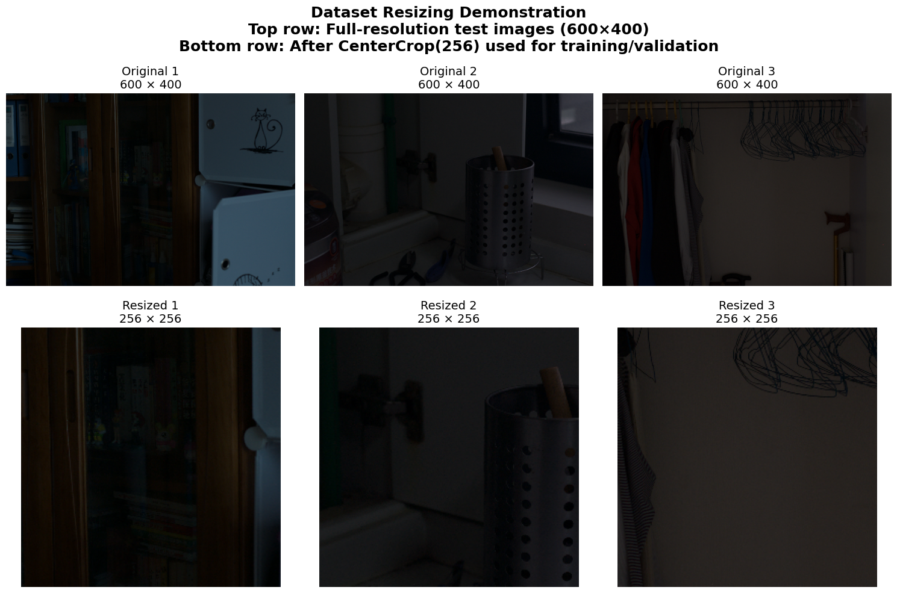
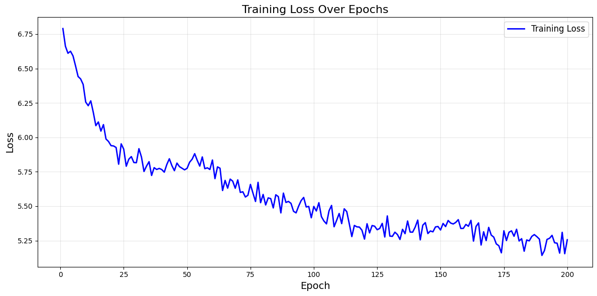
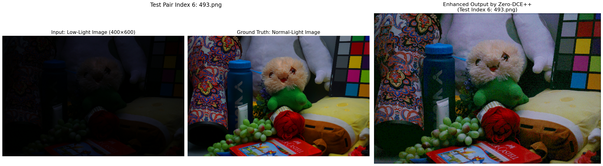
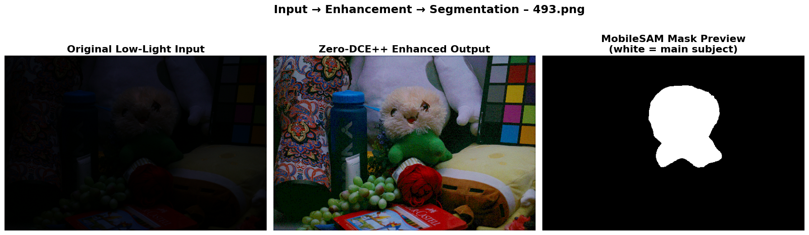
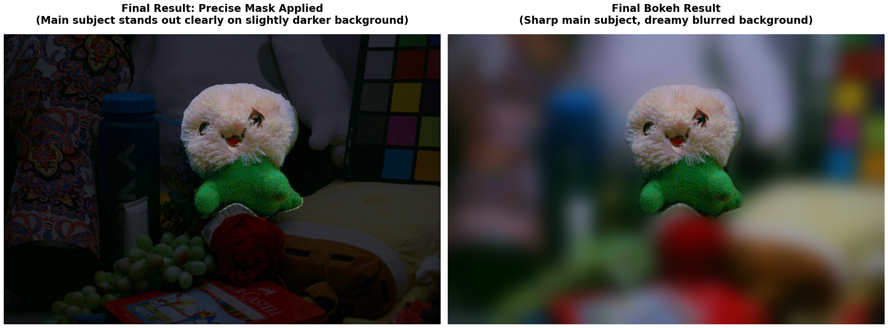

# Low-Light Image Enhancement with Zero-DCE++ and Creative Effects

This repository contains the implementation of a low-light image enhancement model based on a modified Zero-DCE++ architecture, using the LOL (Low-Light) dataset. The project fulfills baseline implementations for image enhancement while introducing two creative functions: **Spotlight Effect** and **Blurry Background**. These effects leverage MobileSAM for subject segmentation to provide targeted post-processing beyond global enhancement.


## Project Overview

- **Dataset**: Low-light and normal-light images from [Kaggle](https://www.kaggle.com/datasets/soumikrakshit/lol-dataset) (485 training pairs, 15 test pairs at 400x600 resolution).

- **Baseline Model**: A customized Zero-DCE++ model, modified for better performance on the LOL dataset (e.g., U-Net-like architecture with skip connections, hybrid supervised/unsupervised losses including L1 and SSIM).
- **Creative Extensions**: 
  - **Spotlight Effect**: Brightens the main subject while keeping the background dark, creating a focused illumination effect.
  - **Blurry Background (Bokeh)**: Applies Gaussian blur to the background, simulating a shallow depth-of-field for a professional portrait-style result.
- These effects use MobileSAM to detect the central subject automatically, enabling selective enhancements.


## Features

- **Efficient Training**: Images cropped to 256x256 during training for speed; full resolution used for inference.

- **Hybrid Loss Functions**: Combines non-reference losses (spatial consistency, exposure, color, smoothness) with supervised L1 and SSIM for better convergence.
- **Epoch Selection**: Trained for 200 epochs, but epoch 20 is selected for optimal balance (good visuals, less training time, no overfitting).

- **Creative Post-Processing**: 
Spotlight: Foreground x2.8 brightness, background x0.15.
Bokeh: Strong Gaussian blur (71x71 kernel) on background.
- **Visualization**: Training loss plots, sample outputs, and full test set results.


## Results

- **Baseline Enhancement**: 
  - At epoch 20, outputs closely match ground truth with natural colors and details.



- **Creative Effects**:
  - Spotlight: focus on subject (bright foreground, dark background).
  - Bokeh: Sharp subject with blurred background for artistic depth.




## Requirements

- Python 3.8+
- PyTorch (with CUDA support recommended for GPU acceleration)
- Additional libraries: `torchvision`, `numpy`, `matplotlib`, `PIL`, `tqdm`, `glob`, `zipfile`
- GPU: Tested on NVIDIA Tesla T4 (Google Colab or similar).

Install dependencies:
```
pip install torch torchvision torchaudio --index-url https://download.pytorch.org/whl/cu118
pip install kaggle matplotlib seaborn tqdm torchmetrics
pip install git+https://github.com/ChaoningZhang/MobileSAM.git
```


## Usage

1. Clone the Repository in VS Code:
   ```
   git clone https://github.com/woopakyi/Low-Light-Image-Enhancement.git
   cd Low-Light-Image-Enhancement
   ```
   Or open the notebook in Google Colab: 
   [](https://colab.research.google.com/github/woopakyi/Low-Light-Image-Enhancement/blob/main/notebook.ipynb)


2. **Prepare Dataset**:
   - Download `archive.zip` (or `lol-dataset.zip`) from [Kaggle](https://www.kaggle.com/datasets/soumikrakshit/lol-dataset).
   - Place the ZIP file in the project root directory.
   - The notebook will automatically extract it to `lol_dataset/` (containing `our485/` for training and `eval15/` for testing).

3. **Run the Notebook**:
   - Execute cells in the `notebook.ipynb` sequentially:
     - **Cell 1-5**: Libraries, setup, and dataset handling.
     - **Cell 6-8**: model definition and loss functions.
     - **Cell 9**: model training and Validation Loss Curves.
     - **Cell 10**: Inference and visualization.
     - **Cell A-D**: MobileSAM setup and creative effects (Spotlight, Bokeh).


## Discussion and Limitations

- **Benefits**: Fast, resource-efficient model with high-quality enhancements. Creative effects add unique value.
- **Limitations**: Occasional over-brightening in complex scenes; MobileSAM may struggle in very dark areas.
- **Future Work**: Add attention modules, fine-tune on low-light data, or enable interactive controls.


## Acknowledgments

- Zero-DCE++: [GitHub](https://github.com/Li-Chongyi/Zero-DCE_extension)
- MobileSAM: [GitHub](https://github.com/ChaoningZhang/MobileSAM)
- LOL Dataset: [Kaggle](https://www.kaggle.com/datasets/soumikrakshit/lol-dataset)

